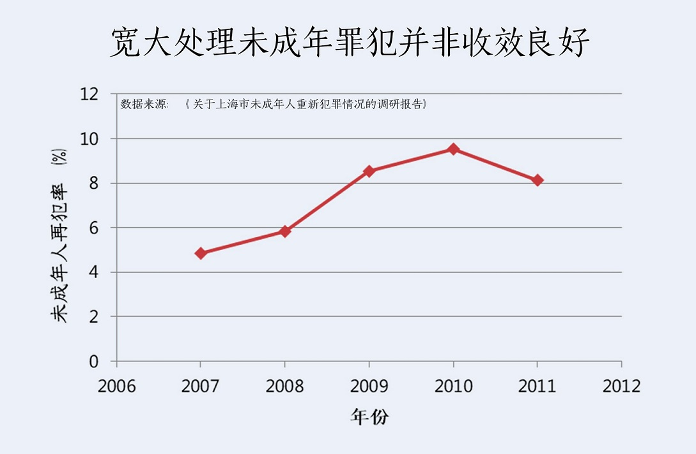
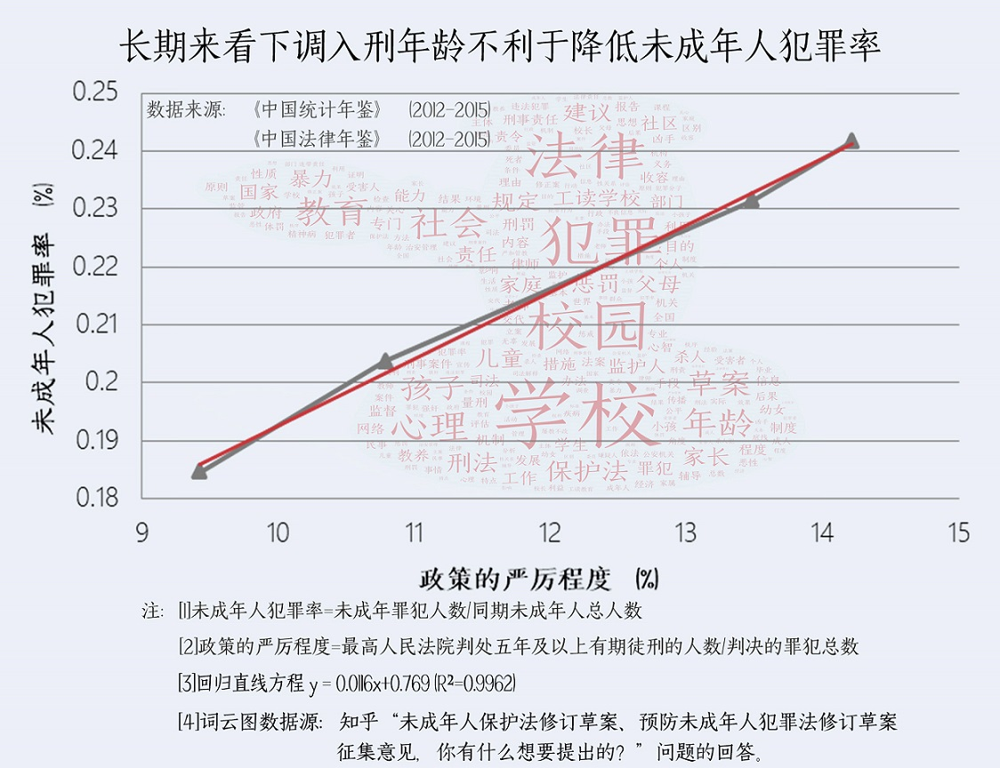
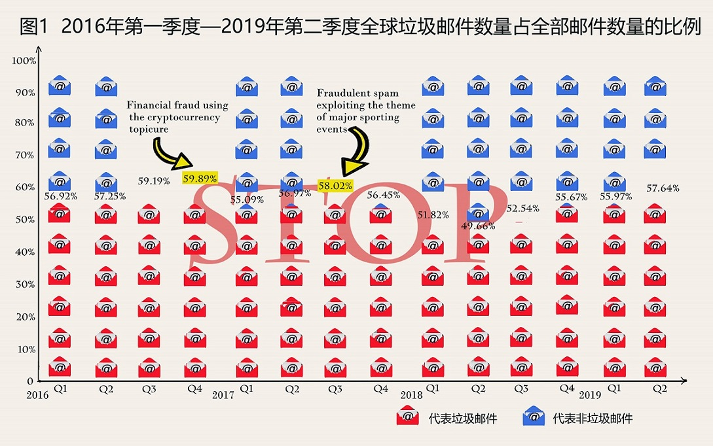
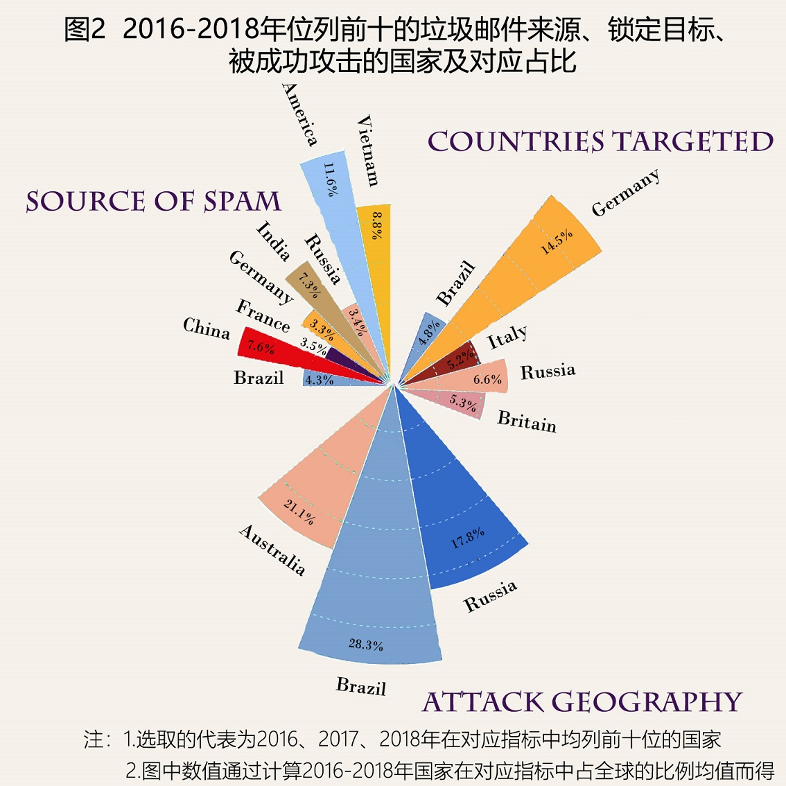

# homework

  
homework_5

  
# 减少未成年人犯罪，不可通过下调刑事责任年龄“一刀切” 
  
&emsp;&emsp;在知乎平台键入“未成年人犯罪”，位列榜首的问题即“未成年人保护法修订草案、预防未成年人犯罪法修订草案征集意见，你有什么想要提出的”，把支持修改刑法的回答包括在内，近**90%** 的人支持修改现行政策，当然**超过半数**评论对我国法律制度持悲观态度，认为“提归提，能否改是另一码事”，且看前者，为什么大家呼吁修改现行政策呢？

&emsp;&emsp;不妨一探现行未成年人犯罪判刑规则和效力。《刑法》第十七条将十四、十六周岁作为是否负刑事责任或完全刑事责任的分水岭，并列出八项严重情节。综合《未成年人保护法》和《预防未成年人犯罪法》可以看出国家极力保护未成年人，并给予充足改过自新机会。近年来，甚至有人提出“隐匿未成年人犯罪记录”的说法，但是这种保护似乎并非收效良好，上海是先行区域，我们通过上海市“**未成年人再犯率**”数据一探究竟。

  

&emsp;&emsp;既然现行政策有无效成分在，那目前呼声较高的举措——下调刑事责任年龄是否就是否有效、科学的呢？

&emsp;&emsp;刑事责任年龄下调实则为变相加重政策的严厉程度，通过格兰杰因果关系检验（一种计量方法），可以确定政策的严厉性的确是引起未成年人犯罪率改变的原因，从短期来看，可以起到一定的威慑作用，但并非一劳永逸，将目光放到更长远的角度，下调刑事责任年龄可能导致未成年人犯罪率的不降反增。

 

&emsp;&emsp;虽然有数据显示，在未成年罪犯占全部罪犯比例上升的同时，成年青少年（18~25岁）罪犯占全部罪犯人数比例在逐年下降，这种上升-下降的反差，一定程度上可以说明罪犯的低龄化。但是目前，这一简单、笼统的结论被反复强调，最终演变成为“16岁甚至14岁以下未成年人犯罪急剧增加”的粗糙印象。深究其关键，根据最高人民法院的统计来看，14岁以下的少年犯，尤其是严重犯罪案件虽然存在，但是极少数。由此也可以看出，单纯下调刑事责任年龄有盲目的成分在其中。

&emsp;&emsp;目前政策存在漏洞是不可否认的事实，但同时仍有较大的讨论空间。比如北京大学法学院的王新教授在访谈中就提到，英国有个处理方法叫**恶意补足年龄**，但这种做法是与判例法法制土壤相结合的，可以借鉴，但是在套用的过程中仍然需要做本土化处理。

&emsp;&emsp;至于是否需要降低刑事责任年龄，这需要进行深入调研，征求全社会的意见，并按照法律修订程序来严格操作，但至少有一点可以肯定，不能单纯停留在惩罚打击的层面。专家指出，法律与时俱进的调整，一定是从对**未成年人保护政策**的角度出发。社会、学校、家庭等因素对于青少年犯罪事前事后处置机制加以完善和修改，同样非常重要。

# 过程步骤

## 数据源

* 朱妙,李振武,张世欣.关于上海市未成年人重新犯罪情况的调研报告[J].上海公安高等专科学校学报,2014,24(03):31-39.

* 林维.未成年人犯罪统计数据研究[J].中国青年政治学院学报,2010,29(03):29-36.

* 《中国统计年鉴》（2012-2015）

* 《中国法律年鉴》（2012-2015）

* 人民网：《未成年人极端犯罪如何量刑处置》

## 方法来源

* 曾鹏,陈嘉浩.我国青少年犯罪的影响因素分析——基于时间序列数据的实证研究[J].青年研究,2019(03):47-56+95.

## 工具

Eviews、PS、Excel、Picular、web scraper

----

&emsp;&emsp;整体思路是先说明现行政策确实有问题在，具体收效不好通过未成年人再犯率来表现。

&emsp;&emsp;之后通过爬取知乎上“未成年人保护法修订草案、预防未成年人犯罪法修订草案征集意见，你有什么想要提出的”这个问题的评论，判断目前的态度走向，结合之前读到的一些评论，发现“下调刑事责任”年龄是目前比较火的议题，随后即探究这种举措是否有效。

&emsp;&emsp;证明的思路有两种：一是各国入刑年龄与该国未成年人犯罪率的统计；而是通过计量模型判断因果关系。最终没有使用前者是考虑到各国文化、心理、经济等因素存在偏差，不容易控制变量。因此，通过使用格兰杰因果关系检验来确定，“下调刑事责任年龄”是否真的能引起未成年人犯罪率下降。

&emsp;&emsp;格兰杰因果关系检验的原理是加入变量B后对变量A的预测效果优于未加入时，则说明变量B是引起变量A变化的原因。

&emsp;&emsp;本题选定的变量A即“未成年人犯罪率”，变量B是“下调刑事责任年龄”。

&emsp;&emsp;关于如何计算变量A，共看到两种方式：未成年罪犯数/未成年人总数；未成年罪犯数/罪犯总数。前者是查找的论文《我国青少年犯罪的影响因素分析——基于时间序列数据的实证研究》给出的计算方式，以及在询问6名同学之后得到了一致的回答；后者是通过《中国儿童发展纲要》中给出的未成年人犯罪率得到的方法。综合考虑，选用前者。

&emsp;&emsp;《中国法律年鉴》可以直接看到未成年人罪犯的具体数值，用作分子。《中国统计年鉴》>人口>按年龄和性别分人口数给出0-4、5-9（……）年龄段的人数，即以5为距；但未成年应当为18岁以下的群体，因此使用线性回归的方式计算出17岁及以下年龄的人数，用作分母。

&emsp;&emsp;等价代替“下调刑事责任年龄”的变量B思路如下：下调入刑年龄之后受刑人数必然增多，因为之前不被判刑的一部分人会被划进去，这就一定程度上代表政策严厉程度加重；而政策的严厉程度再转换一下可以通过判处五年及以上有期徒刑和死刑的人数占判决罪犯总数的比例来替代。

&emsp;&emsp;在确定变量B是引起变量A变化的原因之后，分别将二者视作自变量和因变量制作了折线图并拟合，R²>0.9接近1，说明拟合效果较好，也的确能看出随严厉程度加重，未成年人犯罪率上升的趋势。

&emsp;&emsp;制图本来相用flourish，后来还是对Excel更熟悉一些就用了Excel，背景色本来用了偏粉一些的颜色，后来觉得这个话题比较压抑，就改成了蓝色；第二张图主要想表现一个变量随另一个变化的趋势，因此把拟合用成红色，而实际的线做成了灰色。

# 选题思路

&emsp;&emsp;一开始不知道什么角度切入就去问了很多同学“关于未成年人犯罪你最想了解什么问题”，大家的回答基本上都是关于边界问题的探讨，比如什么样算严重、劳教应该是什么形式、如何去量化等等，甚至会有一些情绪化的表述，诸如“故意行为实在是恶劣，真是应该死刑”一类。后来会宿舍后又跟室友讨论，我们更觉得这是一个需要心理学、社会学等多因素定性判断的东西，很难用数据去做解释，涉及人的议题似乎是有更多个体差异因素在里面。在讨论的过程中，涉及最多的话题就是“刑事责任年龄下调”，我想迟迟不去落实这种措施一方面跟我们国家司法工作人员不愿担责的态度有关，另一方面还需要客观衡量它的有效程度。为了形成一个闭环，我还做了现行政策并非收效良好的证明，因此最后的落脚点是“现行政策有漏洞，要改，是个复杂的议题，不能单纯从入刑年龄一刀切上下手”。

&emsp;&emsp;在操作的过程中“入刑年龄下调”跟“未成年人犯罪率”的关系一直是一种被探讨的关系，倒是没有先入为主，这个时候做简单的线性回归不能说明谁是自变量、谁是因变量，于是就引入了格兰杰因果关系检验的方法，我也不知道该不该在新闻里用这种稍微有点复杂的计量方法，但为了说明问题还是用了。可是用完又发现有点像论文，不敢做格兰杰的图，就把两个变量根据因果分别当横轴和纵轴做了拟合，本来公式是摆在直线旁边的，后来觉得新闻里有公式好像有点奇怪就放在了注释了。真的好纠结啊，我现在都不知道该不该在新闻用这种方法，直接看图说话好像又不太科学，不敢下结论，可是用了又不像新闻……

&emsp;&emsp;这次作业还有一个纠结的地方就是未成年人犯罪率的计算，感觉统计公报有点魔幻。首先是《中国儿童发展纲要》中关于未成年人犯罪率的计算，似乎应该说是“罪犯的未成年率”，不过后来看到《中国统计年鉴》中人口统计方式好像就有点了理解它的方法了，因为18岁以下的人数还要单算，人口统计指标有很多分类，但是没有按成年/未成年这样划分的。

&emsp;&emsp;另外一方面没有做国内外对比的原因是，我认为文化、心理等因素对未成年人行为的影响是相当大的，因此发条对未成年人犯罪率的影响可能因国家、民族而异，这种对比没有办法控制变量，不够严谨，但是用公式说明问题实在有些枯燥，所以新闻到底有没有必要这么严格（？）
  

  
homework_4（1.0）

  
# 作业

&emsp;&emsp;提到“垃圾+科技”，你的脑海中最先出现的检索出来的是什么？或许是流行的垃圾处理黑科技。但正如流行的商铺电子化一样，垃圾也不一定是实体的存在，“垃圾邮件”就是我们日常生活中逃离不开的形式之一。

&emsp;&emsp;自2016年以来，“垃圾邮件”的占比呈波动态势，看不出明显上升或下降的走势，但从2016年第4季度和2017年第3季度两处峰值不难发现，金融理财、依附于体育赛事的博彩项目是“垃圾邮件”的高发地带。

&emsp;&emsp;再进一步，发送“垃圾邮件”多的国家同样会成为靶子吗？那成为靶子的国家又一定会陷入“垃圾邮件”的圈套吗？

&emsp;&emsp;数据表明，上述两个问题的答案都是否定的。有趣的一点是，中国近年来发送“垃圾邮件”的比重日益升高，而内容多为电子促销券，这也在一定程度上反映出我国电商行业的蓬勃发展。

&emsp;&emsp;当然，随着科技的迭代、热点事件的发生，“垃圾邮件”的内容和数目也在不断变化，因此，为了不成为“被钓之鱼”，在解决实体垃圾的同时，警惕电子垃圾也十分必要。

# 步骤

数据来源：卡巴斯基实验室官网关于垃圾邮件的报告 

&emsp;&emsp;2015年及以前的记录单位是月份且没有年报，因此选择自2016年起记录每季度的数据。

&emsp;&emsp;选择的第一个指标是“Proportion of spam in email traffic”在整理过程中发现每年只有前三季度和年报，没有第四季度的数据，因此手动计算了每季度数据即当季三个月的均值，因此通过年报中显示的10-12月的数值计算出第四季度的对应值。

&emsp;&emsp;分析的时候发现没有规律，思路转变为寻找“垃圾邮件”发送高峰的起因，对应报告中的热点事件，找到一个是金融理财，再一个是与体育相关的博彩。

&emsp;&emsp;选择的第二个切入点与各国的发送、被针对和被成功针对的数据。分析的是2016-2018年每个维度内均在top10的国家，所占比例为三年数据的均值，将三项数据放在同一张图内，可以比较直观的看到每个维度下对应国家的“贡献值”。

&emsp;&emsp;第一张图基于柱状图呈现，想用一些跟邮件相关的元素就使用了蓝色铺满、红色填充的形式，一开始做的是只用红色邮件的叠加来体现柱子的高度，因为有些数据区分不是太明显，而且排列过密，效果不是很好，就更换了方式，最后叠上了对应数据的折线图并标出数据，在两峰值出注释了对应原因，为了不过于紧凑，删掉了部分位置的蓝色信封。

&emsp;&emsp;第二张本来想做桑基图，但是发现没有办法确定对应关系，而且国家不固定没有办法做雷达图，因此做了一张玫瑰图的拼图。

&emsp;&emsp;配色参考的网站是picular。使用的工具是镝数平台（玫瑰图）和PS。

# 选题思路

&emsp;&emsp;最先想到的是垃圾分类和可持续发展，同时想到的是能分类的不只是实体垃圾，电子垃圾也算，就打算从垃圾邮件这个角度切入。

&emsp;&emsp;在1991T上找到了两份相关报告，分别是《2019年电子邮件发送者评分报告》《2019年电子邮件基准报告》，在阅读第二份报告的过程根据该网页的推荐发现了卡巴斯基实验室的官网，在该网站追踪找到的比较详细的“垃圾邮件”数据报告。

&emsp;&emsp;一开始在kaggle上找到的数据是关于美国的邮件的，而卡巴斯基的数据恰好有全球的数据，在读报告的时候就想谁发的最多？没想到2018年中国超越美国成了top1，报告给出的解释是“内容多为电子购物券”，感觉这确实是一个比较流行且有时代特点的现象；同时也发现被针对的国家不一定容易“宕机”，比如德国一致是“靶榜”的top1，但巴西却一直是被成功针对的top1。

&emsp;&emsp;考虑到“垃圾邮件”对应“钓鱼”这种网络行为，所以最终把落点定在了警惕成为“被钓之鱼”上。

  
homework_3

&emsp;&emsp;本次作业使用的数据集瑞典斯德哥尔摩国际和平研究所(SIPRI)发布的武器工业数据库（1949-2017）。

&emsp;&emsp;因为数据量大，涉及国家众多，所以设计了在世界地图上通过散点图的形式反映2015-2017三年来的数据（年份过多会造成点排布密集，影响阅读效度），国家军备投资力度通过“军事支出数据占政府总支出的百分比”表示。使用的平台是图表秀，但期待掌握的工具是Tableau，因为从配色、呈现效果等多方面看，后者是更优一些的，但前者比较适合“手残新手党”，只需填充数据和调整配色。

&emsp;&emsp;另一种处理数据的思路是展现综合实力排名前10位国家（美国、俄罗斯、中国、英国、法国、德国、印度、日本、加拿大、巴西）的武装力量。一方面，通过带有时间轴的散点图，分别将“军事支出数据占政府总支出的百分比”和“国家军事支出数据占GDP的百分比”作为横纵坐标，以“按当前美元（百万）计的国家军事支出数据”作为调整气泡大小的依据绘制成图。因为太过拖延，所以使用的平台还是“一键制图”的图表秀，希望我能在周末用AE完善这张图，因为在使用图表秀的过程中发现导出GIF的时长至多5秒，导致不得不删掉部分年份的数据。

&emsp;&emsp;最后一张图比较简单，其实可以直接Excel生成，但为了美观（和多用几个工具）我用了“镝数”平台完成折线图，使用的数据是2001-2017年“人均军费数据”通过趋势和数值看出10国个人为单位的武器购买力和动态，一定程度上反映非政府武装力量的强弱。

&emsp;&emsp;本来还做了一张关于10个国家21世纪政府和非政府武装投入的桑基图，但个人投入比例过于小，图片不具观赏性，因此删除了图片。

&emsp;&emsp;其实还想制作一张以手枪为元素各国军事支出的图，在试图制作的过程中也产生一个疑问：数据新闻制作的结点在哪里？我本以为厘清数据、想好图表类型、找到工具就可以了，但在试图做这张图的过程中，我发现每一个图表大类下还有若干具细的分类，而具体到每一张图还有很多细节的问题要思考，比如手枪的图例要与整篇作品的风格相符等，当然原罪是我自己技能太弱以及英语太差（在做作业的过程中，我甚至因为没有找到英国而Google了所有国家的中文，最后发现英国是AK，之后觉得America好像怪怪的，检索发现美国是USA……）

&emsp;&emsp;除了之前了解和使用过的工具，结合选题的性质，我查阅了一篇题为“情报产品可视化展示模式和方法研究”的论文，论文中对于图表类型与信息呈现、平台工具的解释拓宽了我的视域，但在了解到众多工具并立下尽可能多学的flag之后我也不免疑问：究竟将几个工具掌握精还是在入门层面掌握更多工具的使用规则对于行业实操更有意义？

  

homework_2（待修改）

# （一）	我国还有哪些关于公共数据开放的条例或法规？

1.[《国务院关于印发促进大数据发展行动纲要的通知》（国发〔2015〕50号）](http://www.gov.cn/zhengce/content/2015-09/05/content_10137.htm)

2.[天津市促进大数据发展应用条例（2018/12/14）](http://www.tjrd.gov.cn/flfg/system/2018/12/17/030011277.shtml)

数据源：天津人大网	

具体位置：第二章 政务数据 第二节 数据共享 第三节 数据开放 第四章 开发应用

3.[杭州市政务数据资源共享管理暂行办法（杭政办函〔2015〕11号）](http://www.hangzhou.gov.cn/art/2015/3/31/art_807152_1052.html)

数据源：杭州市人民政府网

具体位置：八、数据共享以你雇佣

4.[武汉市政务数据资源共享管理暂行办法（武政办〔2015〕146号）](http://www.wuhan.gov.cn/hbgovinfo/szfxxgkml/fggw/bgtwj/201512/t20151230_43843.html)

数据源：武汉市人民政府网

具体位置：第三章 数据共享应用

5.[常德市政府数据资源共享管理暂行办法（常政办发〔2016〕18号）](http://www.changde.gov.cn/art/2016/7/13/art_8683_2645.html)

数据源：常德市人民政府

具体位置：第四章 共享应用

6.[温州市政务数据资源共享管理办法(试行)	（温政办〔2016〕138号）](http://www.wenzhou.gov.cn/art/2016/12/30/art_1229314_40769.html)

数据源：温州政府网

具体位置：第四章 数据资源共享

7.[浙江省公共数据和电子政务管理办法（省政府令354号 2017/3/27）](http://www.zj.gov.cn/art/2017/3/24/art_37172_290866.html)

数据源：浙江政府服务网

具体位置：第三部分 管理和应用

8.[贵阳市政府数据共享开放条例（2017/4/11）](http://www.guiyang.gov.cn/zwwgk/jcgk/jchgk/fggw/20180930/i1818010.html)

数据源：贵阳市人民政府网

具体位置：第三章 数据共享

9.[延安市政务数据资源共享管理暂行办法（延政办发〔2017〕44号）](http://www.yanan.gov.cn/gk/zfwj/szfbwj/292787.htm)

数据源：延安市人民政府网

具体位置：第四章 数据资源共享    第五章 数据资源开放

10.[巢湖市政务数据资源共享开放管理暂行办法（巢政办〔2018〕2号）](http://zwgk.hefei.gov.cn/zwgk/public/spage.xp?doAction=view&indexno=00326508X/201801-00098	)

数据源：合肥市政府信息公开网

具体位置：第三章 数据共享     第四章 数据开放

11.[江门市政务数据资源共享和开放管理暂行办法（草案）（2018/3/13）](http://www.jiangmen.gov.cn/szdwzt/jmzwfwsjglig/zwgk/ztgg/201901/t20190109_1799618.html)

数据源：江门市人民政府网

具体位置：第四章 政务数据共享     第五章 政务数据开放

12.[吉安市政务数据共享管理暂行办法（吉府办发〔2018〕10号）](http://www.jian.gov.cn/news-show-34573.html	)

数据源：吉安市人民政府网

具体位置：第五章 共享使用

13.[西安市政务数据资源共享管理办法（市政发〔2018〕47号）](http://www.xa.gov.cn/gk/zcfg/szfwj/5d49363ff99d6572b76b86ca.html)

数据源：西安市人民政府网

具体位置：第六章 共享与使用     第七章 开放与开发

14.[吉林省公共数据和一网通办管理办法(试行)（吉政发〔2019〕4号）](http://xxgk.jl.gov.cn/szf/gkml/201901/t20190117_5486564.html)

数据源：吉林省人民政府官网

具体位置：第四章 公共数据共享和开放

15.[佛山市政务数据资源管理办法（公众征求意见稿）（2019/5/7）](http://www.foshan.gov.cn/hdjl/yjzj/yjzqjs/201905/t20190507_7481597.html)

数据源：佛山市人民政府网

具体位置：第六章 数据共享使用       第七章 数据开放应用

16.[沈阳市政务数据资源共享开放条例（征求意见稿）（2019/7/11）](http://www.shenyang.gov.cn/html/SY/154700104418245/154700104418245/null/0441824526425348.html	)

数据源：沈阳市人民政府网

具体位置：第三章 政务数据资源的共享      第四章 政务数据资源的开放

17.[部省水运政务数据共享工作方案（交办水函〔2019〕1156号）](http://www.gov.cn/xinwen/2019-08/21/content_5423022.htm)

数据源：中央人民政府网	

18.[上海市公共数据开放暂行办法（沪府令21号	2019/9/10）](http://www.shanghai.gov.cn/nw2/nw2314/nw2319/nw2407/nw45024/u26aw62638.html)

数据源：上海政府网	

[官方解读](http://www.shanghai.gov.cn/nw2/nw2314/nw2319/nw41893/nw42230/u21aw1401306.html)

**思路**

&emsp;&emsp;在了解条例和法规的定义（条例是国家权力机关或行政机关依照政策和法令而制定并发布的；法规是法令、条例、规则和章程等法定文件的总称）之后，我首先尝试寻找有相关政策制定诉求和能力的相关政府和部门，发现一篇报道[王蕤,杨春立,余坦.政务数据共享的必要性[N].中国计算机报,2019-09-09(14).]( https://kns-cnki-net.w.cuc.edu.cn//KXReader/Detail?TIMESTAMP=637060867275706250&DBCODE=CCND&TABLEName=CCNDLAST2019&FileName=JSJB201909090140&RESULT=1&SIGN=zMS6pdi8gGjEoSnBRgeuLkKvWVU%3D)中提到目前我国有山东省、广东省、贵州省、浙江省、福建省、吉林省、广西壮族自治区、河南省、江西省、内蒙古自治区、重庆市、上海市12个省级大数据管理机构，以及广州市大数据管理局、沈阳市大数据管理局、成都市大数据管理局、兰州市大数据管理局、黄石市大数据管理局、保山市大数据管理局、咸阳市大数据管理局、昆明市大数据管理局、贵阳市大数据发展管理委员会、银川市大数据管理服务、宁波市大数据管理局、杭州市数据资源管理局、中卫市云计算和大数据发展服务局、合肥市数据资源局、酒泉市大数据管理局、黔南州大数据管理局、南通市大数据管理局、江门市大数据管理局、徐州市大数据管理局、深圳市龙岗区大数据管理局、五华区大数据管理局21个地市大数据管理局。

&emsp;&emsp;但在山东省和广东省数据管理局网站搜索之后，并没有找到类似《上海市公共数据开放暂行办法》的政策，意识到存在制定政策的有可能是上级部门等各种因素，以及通过名为[国脉电子商务网]( www.echinagov.com)的商业网站找到了上述具体33个管理局的名称，因此在该网站通过“国脉电子政务网 > 政策 > 政策库 > 大数据（内容标签）”的路径搜索相关条例、法规。最终共检索出294条相关信息，在Excel中分别通过“数据+条例/法规”“公共数据/政府数据+共享/公开”六种关键字组合筛选出17条满足条件的文件，罗列如上。

# (二)	国内外有哪些政府开放数据平台？ 

## 四川省

[成都市公共数据开放平台](http://www.cddata.gov.cn/)

[四川省人民政府网站](http://www.sc.gov.cn/10462/13797/index.shtml)

[雅安市人民政府数据开放栏目](http://www.yaan.gov.cn/shuju.html)

## 北京市

[北京市政务数据资源网](http://www.bjdata.gov.cn/jkfb/index.htm)

## 上海市

[上海市政府数据服务网](http://www.data.sh.gov.cn/home!toHomePage.action)

## 天津市

[天津市信息资源统一开放平台](https://data.tj.gov.cn/)

## 福建省

[福建省公共信息资源统一开放平台](https://data.fujian.gov.cn/odweb/)

[厦门市大数据开放平台](http://data.xm.gov.cn/)

## 广东省

[开放广东](http://gddata.gd.gov.cn/)

[广东省金融数据开放平台](http://210.76.74.192/)

[佛山市政府数据开放平台](http://www.foshan-data.cn/)

[深圳市政府数据开放平台](http://opendata.sz.gov.cn/)

[广州市政府数据统一开放平台](http://data.gz.gov.cn/)

[数据东莞](http://dataopen.dg.gov.cn/dataopen/)

[惠州市政府数据开放平台](http://data.huizhou.gov.cn/)

[珠海市民生数据开放平台](http://data.zhuhai.gov.cn/)

[广东省政府数据统一开放平台-潮州市](http://gddata.gd.gov.cn/index.php/data/ls/Type/0/v/344.html)

[广东省政府数据统一开放平台-河源市](http://gddata.gd.gov.cn/index.php/data/ls/Type/0/v/339.html)

[江门市数据开放平台](http://data.jiangmen.gov.cn/)

[中山市政府数据统一开放平台](http://zsdata.zs.gov.cn/web/index)

[肇庆市人民政府数据开放平台](http://www.zhaoqing.gov.cn/sjkf/)

## 贵州省

[贵阳市政府数据开放平台](http://www.gyopendata.gov.cn/)

[遵义市政府数据开放平台](http://www.zyopendata.gov.cn/)

[铜仁市政府数据开放平台](http://gztrdata.gov.cn/)

## 海南省

[海南省政府数据统一开放平台](http://data.hainan.gov.cn/)

## 河南省

[河南省公共数据开放平台](http://data.hnzwfw.gov.cn/odweb/)

## 江西省

[江西省政府数据开放网站](http://data.jiangxi.gov.cn/)

## 宁夏回族自治区

[宁夏回族自治区数据开放平台](http://ningxiadata.gov.cn/odweb/index.htm)

[石嘴山政府数据开放平台](http://szssjkf.nxszs.gov.cn/)

[银川市城市数据开放平台](http://data.yinchuan.gov.cn/)

## 山东省

[山东公共数据开放网](http://data.sd.gov.cn/)

[济南市公共数据开放网](http://www.jndata.gov.cn/)

[青岛公共数据开放网](http://data.qingdao.gov.cn/)

## 陕西省

[陕西省公共数据开放平台](http://www.sndata.gov.cn/)

## 浙江省

[浙江政务服务网“数据开放”专题网站](http://data.zjzwfw.gov.cn/)

[宁波市政府数据服务网](http://www.datanb.gov.cn/nbdatafore/web/indexpage.action)

## 安徽省

[合肥市政府数据开放平台](http://61.133.142.137)

[蚌埠市信息资源开放平台](http://data.bengbu.gov.cn/)

[黄山市人民政府数据开放栏目](http://www.huangshan.gov.cn/DataDevelopment/showTopicContentList/8/page_1.html)

## 湖北省

[武汉市政务公开数据服务网](http://www.wuhandata.gov.cn/whData/)

## 湖南省

[长沙市政府门户网站数据开放平台](http://www.changsha.gov.cn/data/)

## 江苏省

[苏州市政府数据开放平台](http://www.suzhou.gov.cn/dataOpenWeb/data)

[常州市政府数据开放平台](http://opendata.changzhou.gov.cn/)

## 黑龙江省

[哈尔滨市政府数据开放平台](http://data.harbin.gov.cn/)

## 新疆维吾尔自治区

[新疆维吾尔自治区政务数据开放网](http://data.xinjiang.gov.cn/index.html)

## 台湾

[台湾](http://data.gov.tw/)

## 香港

[資料一線通](DATA.GOV.HK https://data.gov.hk/sc/)

## 澳门

[澳门](https://www.dsec.gov.mo/home_zhmo.aspx)

--------

云南、内蒙古、广西、西藏、重庆、辽宁省、吉林省、河北省、山西省、甘肃省、青海省暂无。

--------

*信源：《[最全的中国开放数据(open data)及政府数据开放平台汇总](http://www.tanmer.com/blog/451)》*

----------

## 国外

[纽约政府开放数据平台](https://opendata.cityofnewyork.us/)

[旧金山政府开发数据网站San Fransisco Government Open Data](https://datasf.org/opendata/)

[休斯顿市开放数据门户网站](http://data.houstontx.gov/)

[美国官网数据超市](https://www.data.gov/)

[美国人口普查局United States Census Bureau](https://www.census.gov/)

[美国国家环境信息中心National Climatic Data Center – NOAA](https://www.ncdc.noaa.gov/)

[美国宇航局ClimateData.us ](http://www.climatedata.us/)

[瑞典统计局Sweden, Statistics](https://www.scb.se/en/)

[印度开放政府数据Open Government Data Platform India](https://data.gov.in/)

[新加坡政府开放数据平台](https://data.gov.sg/)

*信源：《[【Open Data】国外开放数据中心及政府数据开放平台汇总]( http://www.tanmer.com/blog/537)》*

-----------

**除了上述网站外，《数据新闻概论（第二版）一书》还提到以下满足要求的平台：**

[英国政府网站](GOV.uk)

[美国联邦政府官方网站](USA.gov)

[英国政府数据网站](data.gov.uk)

[“国家数据”平台](data.stats.gov.cn)

[中国政府网](gov.cn)

# (三)	2012-2018年各季度GDP增速

&emsp;&emsp;在国家统计局数据库>[季度数据](http://data.stats.gov.cn/easyquery.htm?cn=B01)>指标>国民经济核算目录下分别找到国内生产总值（现价）和国内生产总值（不变价）自2018年第四季度至2011年第一季度的数据，由于网站只能一次性出现18个季度的数据，因此2014年及之前的数据需通过键入“年份+代表季度的字母”查找。

&emsp;&emsp;通过季度间差值/上一季度的数据和同期差值/上一期数据分别计算得出名义环比/同比（现价）和实际环比/同比（不变价）的值，通过查找资料发现实际与名义增速之间的区别在于平减指数，有时用CPI替换，但使用这两个指数的意义也在于消除通货膨胀等现实因素造成的差距，所以推断不变价数据计算得出的增速为实际增速。

&emsp;&emsp;但是，在与官方网站给出的环比数据进行对比发现与我个人的计算结果不同，这其中可能还有一些繁杂的计算有待之后深入了解，具体数据和计算过程如下（鼠标悬停在图片上可以看到图表标题）。

--------

---------

---------

-----------

----------
 

-----------

----------

 

-------------

homework_1

# 一、	收集及可视化过程操作、感想

&emsp;&emsp;其实最开始想到的选题是每天听了哪些歌（网易云音乐有“最近播放”列表，但我总是会忘记当天听的第一首歌是什么），跟哪些人聊了天、聊了什么，每天在微博上浏览了哪些话题，但最后我考虑了很多天，因为觉得我一旦想要搜集，而且还属于比较隐私的数据，我的行为必定会受到影响，比如我肯定会为了表现自己坚定好学而少点击娱乐消息，会为了让自己看起来有点音乐品味而少听旋律洗脑的“口水歌”，以及为了表现出彬彬有礼、说话得体而克制发最常用的“哈哈哈哈哈哈哈”。

&emsp;&emsp;综合考虑，在初步定下的选定中，可行性最高的是搜集“在看”列表中的好友姓名和阅读的文章。但考虑到这样搜集最后呈现出来的效果可能会涉及好友的隐私，这个思路便作罢。

&emsp;&emsp;回到我自己身上，我想或许我可以综合一下各类指标平衡来对自己的日常生活做一个评估，看看自己把时间都花在了哪里，也顺便挖掘一下自己的兴趣爱好和性格特点的内在联系。

&emsp;&emsp;抱着这样的想法我初步决定把自己的生活分为四个维度：学习（读书、写作业、背单词等）、娱乐（听音乐、刷微博、看综艺等）、日常环节（吃饭、洗漱）以及社交（聊天、朋友圈点赞、评论等）。

&emsp;&emsp;随着条目的逐渐细化，我发现我试图建立的评价体系并没有越来越清晰，反而更繁复、更说不清了。于是我决定在三级指标的基础上捏合一些指标为二级指标。也随着自己第一步没有掌握好绘图的尺寸，导致圆盘不能过度细分，因此将错就错，做出了上课、吃饭、看书、睡觉、参加国庆爱国活动这样几个大类，其中特殊标出的是给我留下深刻印象的事件。

&emsp;&emsp;在我自己的第一张手绘作业中，我选择用变体时间轴的形式展示9月21日0:00至9月25日24：00五天的日常，之所以选这几天以及作业交迟的原因是因为我个人遇到一件我自认为20年人生经历的至暗时刻，也就是我在手稿中完全涂黑的时段。

&emsp;&emsp;为了让自己尽可能多的运用图形思维，也尽可能少地使用汉字，我选择用色彩表示情绪和分类。首先是蓝色，既代表我的日常活动——溜达，又代表睡眠。前者通常与音乐相伴随，虽然我没有做最后的定量统计，但根据我个人的回忆，在情绪低落期间我通常听“李荣浩”的歌曲，情绪高亢的阶段，我通常听比较“甜”的韩文歌曲；而后者，在区域较大的地方，我画了最常用的“晚安”表情包，区域较小的位置则用三个Z或“Hulu”的拟声词来指代。绿色代表日常起居：洗漱、在路上行走以及餐食非常不同的三餐。紫色代表读书，这段期间我主要读了《飘》，因此用此书的英文名、缩写或作者名字指代。棕色、黄色代表上课时间，为了简便处理不把时间切的过碎，我将课间时间等分到课堂和前一个活动上。

&emsp;&emsp;此外，我用颜色的深浅和圆形的位置来代表我的情绪状态。圆形与时钟形状类似，因此24等分可以代表一天24小时，我将纸张对折，折痕代表我毫无情绪波动的状态，折痕以下的区域代表我心情低落的状态，我用圆的位置逐渐上升至折痕以上表达我的心情逐渐有所好转。折痕以下的部分颜色比较深，而以上的部分颜色更为明亮。我认为这样表示情绪更为直观。

&emsp;&emsp;，这是我与同学通话过程中的一个小插曲，他的耳机坏了，所以其中一个耳机的部分音量采用了静音的图表；再一个是爬虫课，我试图用乱序排列的#、*、Python图表、换行符等来表示；还有一个是Monday的小喇叭代表我跟妈妈的争吵，梗出自我的爸爸，他会说妈妈是“小喇叭开始广播啦”。

&emsp;&emsp;第二张手绘作品是我在没有统计“在看”、每天听的音乐、看的话题等操作后曲线救国的路线。这个灵感来自于QQ空间的“周报”，其内容是分析用户这一周访客的性别占比、年龄占比和第一个访客及访问次数最多的访客。这是基于数据抓取给出的一个相对巨细的用户访客画像，但实际上再细一步，根据我们自己对好友的了解，我们可以将信息进一步细化，我统计了跟第一张手绘图同期的QQ说说和微信朋友圈内容，用两个平台特有的图标代表点赞和评论，因为与我互动的只有高中和大学同学，且女生居多，大学男同学和高中男同学未在同一动态的点赞和评论中同时出现，所以我将每一条动态的互动好友分为三类：男生、大学女同学和高中女同学，并用同一色系的不同颜色表示，其中比较特殊的是9月23号的微信朋友圈混入了我的表哥，我用橙色标注了出来。脱敏的处理就非常拙劣了，看起来像是一些不可名状的内容，但其实是我个人比较负面或者幼稚的言论，我觉得不好意思放在作业里上交。

&emsp;&emsp;这次作业是我第一次尝试不将数据认为是纯数字的基础上所做的呈现。我对“数据新闻”中的“数据”第一次改观发生在阅读《数据新闻概论》之后，按照我初始的理解，也是我报考这个专业的原因，数据新闻较传统新闻的区别在于引入数据使报道在纯文字的基础上更为客观，加之对数理知识的热爱，我对数据的认知就更局限于数字处理的技巧决定了数据新闻水平的高低。后来通过学习，我意识到这是一种较技术决定更为局限的认知，数据不仅是数字，更为广义的层面它代表一种处理资料的方式。

&emsp;&emsp;确实，当数据被理解为资料的时候有一种打开新世界大门的感觉。但在实操过程中我还意识到很多不足，首先我第一份手绘作业的数据收集方式是回忆，虽然这使得我对情绪的评价较为客观，但也是我所罗列的时间基本上都是正点的原因，我没有办法回忆起更巨细的东西，但如果我真的即时记下的话，就像我想立社交媒体人设一样，我的行为一定会受到影响，所以我甚至想是不是真的只有大数据才公正呢？可是我做第二张手绘作业的时候我又发现，大数据的结果看似有针对性性实际不然，我的空间访客女同学居多不假，但我的历个阶段女同学多于男同学也是事实。非常希望老师在课堂上能给出解答、指点：究竟什么样的数据收集方式更合理一些？即时收集还是“出其不备”？

# 二、	你认为日常生活中哪些数据是被搜集的？被谁搜集了？

&emsp;&emsp;我认为被搜集的数据大致分为两种：一种是被主动透露出去的，另一种是被被动搜集走的。主动的方式可以举这样一个例子：我们想要领取某种福利，比如领取取暖补助，为满足要求就要事先说清楚自己的住房面积、家庭人口数，地方办事处接收到的数据就是被有特定需求的人主动透露出去的。被动被搜集的数据也分自愿和非自愿两类，自愿的，比如说学校每年的信息采集，作为个人而言我们是很难自己主动去找个机器输入自己认为的基本信息，但学校在搜集的时候我们也不会拒绝，因为我们也知道这是为了我们自己日后更好的享受校园生活而做的前期准备；非自愿被搜集比如很多APP，我们为了正常使用不得不开一些权限，但很多时候可以发现，针对性内容的推送其实跟开了权限有很大关系，这不仅会造成内卷化，甚至可能窃取不必要的隐私；再如社会上流通的贩卖信息的行为，我们不定期街道的推销电话就是很好的例证。

&emsp;&emsp;被谁搜集了？在我看来是被有利可图者搜集了，APP搜集了用户喜好，针对性推送产品，一定程度上就提高了电商市场的活力；电话推销也是如此，容易上当受骗的老年群体就是正中下划的典型；而被主动透露的数据看起来提供方需求更强烈，但接收方也是或为了更顺利的工作、或为了日后存档等目的而搜集，只是对比之下表现不算突出罢了。

&emsp;&emsp;总体来看，我认为善用数据能获得的利好是很多的，但前提是善用，也希望自己能够掌握在不侵犯别人权利的前提下搜集有用数据的能力。

